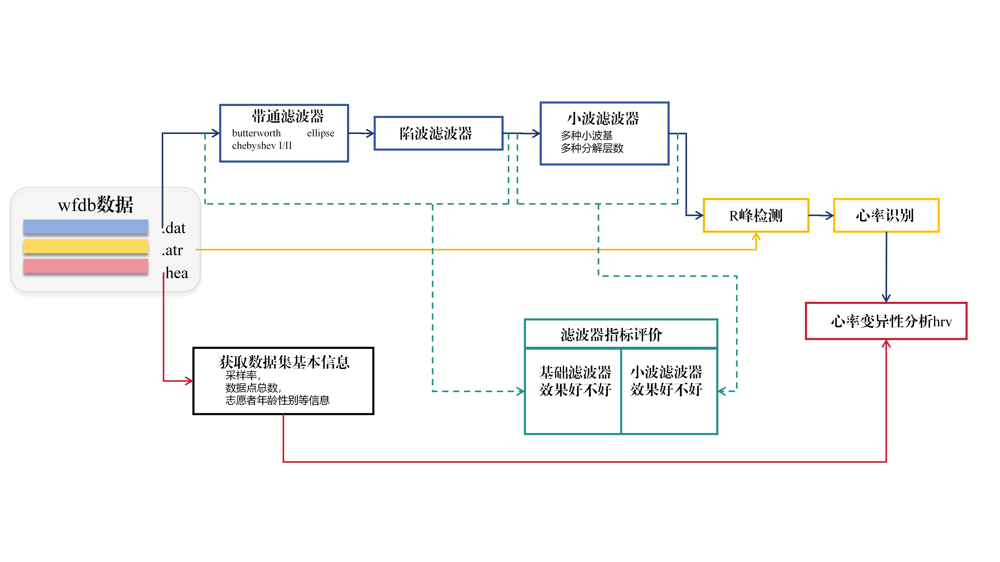
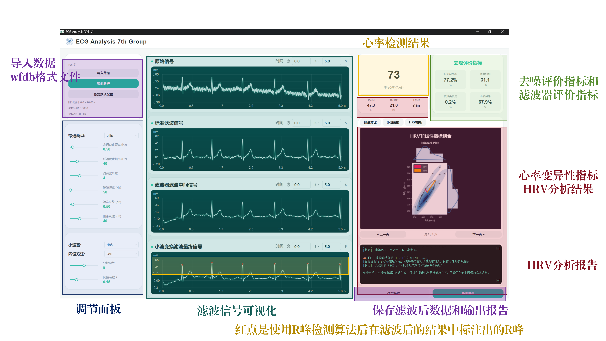

# 🫀 心电图去噪与心率识别分析系统 (ECG Analysis System)


> **👨‍💻 开发团队**：第七组 (7th Group)  
> **👥 小组成员**：刘世雄、张铭一、臧俊宇、祁子轩  

本项目是一个具备 **现代化医疗监护仪表盘界面（GUI）** 的综合心电信号（ECG）处理与分析系统。本系统集成了心电信号读取、多种 IIR 滤波去噪、小波变换（DWT）降噪、自适应 Pan-Tompkins R峰检测、心率识别、去噪性能评估以及全维度的心率变异性（HRV）医学分析功能。

---

## 📸 系统预览

### 🌊 算法工作流


### 🖥️ 软件主界面


#### 🎛️ 面板功能说明
*   **参数调节面板**：
    *   **带通滤波器 (IIR)**：可选滤波器类型（巴特沃斯、切比雪夫、椭圆等），支持高/低通截止频率、滤波器阶数、通带波纹、阻带衰减调节。
    *   **陷波滤波器**：自定义工频干扰消除频率（如 50Hz/60Hz）。
    *   **小波变换 (DWT)**：自由选择小波基（db, sym 等）、分解层数。
    *   **小波滤波力度**：支持软/硬阈值方法，可精细调节阈值系数。
*   **📈 波形可视化模块**：
    1.  **原始信号**：直接读取的未处理 ECG 波形。
    2.  **基准滤波信号**：数据集自带的预滤波信号（用作效果对比参考）。
    3.  **IIR 中间信号**：经过带通与陷波器处理后的平滑信号。
    4.  **DWT 最终信号**：经过小波去噪并完成 R 峰标记的最终纯净信号。

---

## ✨ 核心功能特性

*   🎨 **现代化医疗级 GUI**：基于 `PySide6` 打造的高端医疗监护面板，支持波形动态缩放、平移及多参数实时交互调节。
*   📂 **标准数据库兼容**：原生支持读取 PhysioNet WFDB 格式数据（如 MIT-BIH, ECG-ID 等），自动解析 `.atr` 标注文件与患者临床信息（Age, Sex, 既往病史）。
*   🔗 **级联信号去噪流水线**：
    *   **IIR 滤波器**：支持椭圆 (Ellip)、巴特沃斯 (Butter)、切比雪夫 I/II 型带通滤波，以及 50/60Hz 工频陷波。
    *   **DWT 小波去噪**：支持多种小波基（db4, db8, sym4 等）、自定义分解层数与软/硬阈值去噪。
*   ❤️ **智能 R 峰检测 (Pan-Tompkins)**：改进版 Pan-Tompkins 算法，支持利用标注数据“预热”阈值，具备动态 T 波防误判与漏检回溯机制。
*   📊 **全维度 HRV 分析 (NeuroKit2)**：自动生成时域（SDNN, RMSSD）、频域（LF/HF）、非线性（庞加莱散点图, DFA）指标，并自动输出**临床通俗健康评估报告**。
*   ⚖️ **科学的去噪评估体系**：自动计算波形失真度、ECG频段能量保持率、噪声抑制量（dB）及小波系数衰减率，提供可视化频谱对比。

---

## 📁 项目文件结构

```text
ECG_Analysis/
├── ECG_data/                          # 心电数据存储目录 (示例)
│   ├── Person_01/                     # 受试者1
│   │   ├── rec_1.atr                  # WFDB 标注文件 
│   │   ├── rec_1.dat                  # WFDB 信号数据文件
│   │   ├── rec_1.hea                  # WFDB 头文件 
│   │   └── ...                        
│   └── ...
│
├── ECG_py/                            # 🚀 核心代码目录
│   ├── icon/                          # 界面图标资源
│   ├── APP.py                         # 主程序入口 (PySide6 GUI)
│   ├── read.py                        # WFDB 信号读取模块
│   ├── clean.py                       # IIR 滤波器预处理模块
│   ├── DWT.py                         # 小波变换去噪模块
│   ├── bpm.py                         # Pan-Tompkins R峰检测模块
│   ├── hrv.py                         # HRV 分析与报告生成模块
│   ├── evaluate.py                    # 去噪效果评估模块
│   └── fre.py                         # 频谱分析工具
│
├── APP/                               # 📦 软件及其依赖打包目录
│   └── APP.exe                        # 软件独立启动器
├── APP.bat                            # Windows 快捷方式 (双击启动软件)
│
├── README.md                          # 项目说明文档
└── requirements.txt                   # Python 环境依赖清单
```

---

## 🛠️ 环境依赖与安装

> **📌 推荐环境**：Python 3.8 或以上版本。建议使用 `conda` 或 `venv` 创建虚拟环境。

1. **克隆/下载项目**：
   ```bash
   git clone https://github.com/i7yx/ecg.git
   cd ECG_Analysis
   ```

2. **一键安装核心依赖**：
   ```bash
   pip install -r requirements.txt
   ```

---

## 🚀 快速开始

### I 运行带 GUI 的主程序  (推荐)
如果您不想配置复杂的 Python 环境，可以直接使用我们打包好的 Windows 开箱即用版本。
1. **下载文件**：前往项目主页右侧的 **Releases** 页面，下载最新版中的 `APP.zip` 和 `APP.bat`。
2. **解压存放**：在电脑上新建一个文件夹（例如命名为 `ECG_Analysis`），将 `APP.zip` 解压到该文件夹内。
3. **放置脚本**：将下载好的 `APP.bat` 也移动到刚才新建的 `ECG_Analysis` 文件夹内。
4. **一键启动**：在 Windows 系统下，直接双击运行 `APP.bat` 即可启动图形界面

### II 使用python运行带 GUI 的主程序 

直接运行 `APP.py` 即可启动图形界面系统：
```bash
python ECG_py/APP.py
```
*   **导入数据**：点击界面左上角的“导入数据”，选择扩展名为 `.dat` 的 WFDB 文件。
*   **参数调节**：在左侧面板自由调节 IIR 滤波参数和小波去噪阈值。
*   **智能分析**：点击“智能分析”按钮，系统将自动执行信号处理、R峰检测和 HRV 分析，在右侧展示指标与评估图表。
*   **导出结果**：分析完成后，通过右下角按钮导出 `.csv` 信号数据矩阵或 `.txt` 诊断报告。

### III 纯代码调用示例 (API方式)

系统各模块解耦良好，您可以直接在脚本中组合使用核心功能：

```python
from read import read_ecg
from clean import clean_ecg
from DWT import wavelet_denoise_ecg
from bpm import PanTompkinsBPM
from hrv import hrv_report

# 1. 读取数据 (注意：路径无需加扩展名)
ecg = read_ecg(file_name='ECG_data/Person_01/rec_1', channels=[0, 1])

# 2. IIR 基础滤波
ecg_clean = clean_ecg(ecg).apply_filter()

# 3. 小波去噪
ecg_dwt = wavelet_denoise_ecg(ecg_clean, wavelet='db8', level=5).denoise(method='soft')

# 4. Pan-Tompkins 提取 R 峰
detector = PanTompkinsBPM(ecg_dwt)
r_peaks, bpm = detector.detect()
print(f"✅ 检测心率: {bpm:.1f} BPM")

# 5. 生成 HRV 评估图表与报告
hrv = hrv_report(ecg_dwt, detector)
hrv.print_report(report_dir="./report", image_dir="./image")
```

---

## 📝 数据格式说明

本项目默认处理 PhysioNet 提供的 **WFDB 格式** 信号。典型的数据包含以下三个文件（至少需要前两个）：

*   📄 `rec_1.dat`：二进制信号数据文件。APP 支持**单通道** (Channel 0: 原始信号) 或 **双通道** (Channel 0: 原始信号, Channel 1: 预先滤波的参考信号)。
*   📄 `rec_1.hea`：头文件，包含采样率、导联信息、患者基础注释等。
*   📄 `rec_1.atr`：*(可选)* 专家手工标注的 R峰/早搏 位置文件，有此文件系统会自动预热阈值。

---

## ⚠️ 注意事项与免责声明

> 💡 **UI 图标缺失**：若运行 `APP.py` 时未找到 `icon/logo.png` 等本地 UI 资源，程序会自动启用备用 Emoji 进行渲染，**不影响**任何核心功能运行。

> ⏱️ **分析性能参考**：一段 5 分钟的 ECG 信号片段，完整的全链路分析耗时约为 **30秒**。请参考该数据，处理中若无响应属正常计算过程，请确保程序未被系统强杀。

> ⚖️ **医学免责声明**：本系统及自动生成的 HRV 健康报告**仅供学术研究、课程设计与日常健康状态参考**，**不可替代任何专业医生的临床诊断**。

---

## 🤝 贡献与支持

感谢您对本项目的关注！如果觉得有帮助，欢迎给个 ⭐ **Star**！  
欢迎通过提交 Issue 或 Pull Request 来协助我们改进系统。 

**© 2024 - 7th Group** | ECG Denoising and Heart Rate Recognition Project.